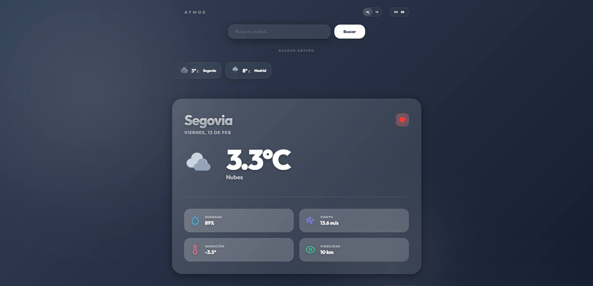

# 🌌 Atmos | Visualización Meteorológica Premium

Atmos es un dashboard de clima de alto rendimiento desarrollado con **Angular 19**. El proyecto destaca por un sistema de diseño inmersivo basado en **Glassmorphism 3.0**, una gestión de estado ultra-eficiente mediante **Angular Signals** e interfaces fluidas con visualizaciones de datos avanzadas.

  
  

---

## 🇪🇸 Castellano

Atmos ha sido diseñado para ofrecer una experiencia de usuario premium, combinando una estética moderna con una arquitectura técnica robusta.

### ✨ Características Principales
- **💎 Glassmorphism de Vanguardia**: Transparencias multicapa con textura de ruido sutil y gradientes de malla CSS dinámicos.
- **⚡ Reactividad con Signals**: Uso de **Angular Signals** para un estado global ligero, optimizando el rendimiento frente a detectores de cambios tradicionales.
- **🌡️ Análisis de Datos**: Gráficas interactivas que muestran la evolución térmica de las últimas 24 horas mediante **Chart.js**.
- **☀️ Inteligencia Solar**: Visualización dinámica del ciclo solar que sigue el progreso del amanecer y el atardecer en tiempo real.
- **🌍 Internacionalización**: Soporte nativo multilingüe (ES/EN) con detección inteligente del idioma del navegador.
- **🧤 Calidad Senior**: Skeleton loaders integrados, animaciones escalonadas y efectos de profundidad paralaje.

### 🛠️ Stack Tecnológico
- **Core**: Angular (Standalone Components)
- **Estado**: Angular Signals (Idiomas y Favoritos)
- **API**: Integración con OpenWeatherMap y autocompletado inteligente
- **Persistencia**: LocalStorage para una gestión de favoritos persistente
- **Infraestructura**: GitHub Actions CI/CD y Vitest para pruebas unitarias
- **Estilos**: Vanilla CSS Moderno (Variables, HSL, CSS Grid y Flexbox)

### 🚀 Guía de Inicio

#### Requisitos
- Node.js (v18+)
- Angular CLI

#### Instalación y Uso
1. **Clonar el repositorio**: `git clone https://github.com/laupm3/weather-app.git`
2. **Instalar dependencias**: `npm install`
3. **Lanzar la aplicación**: `npm start`
4. **Ejecutar tests**: `npm test`

---

## 🇺🇸 English

Atmos is designed to deliver a premium user experience, blending modern aesthetics with a robust technical architecture.

### ✨ Key Features
- **💎 Cutting-edge Glassmorphism**: Multi-layered transparency with subtle noise textures and dynamic CSS Mesh Gradients.
- **⚡ Signal-Driven Reactivity**: Hybrid architecture using **Angular Signals** for state management and **RxJS** for asynchronous streams.
- **🌡️ Data Insights**: Interactive 24-hour temperature evolution graphs powered by **Chart.js**.
- **☀️ Solar Intelligence**: Real-time Sun Arch visualization tracking sunrise and sunset progress.
- **🌍 Global by Design**: Full i18n support (ES/EN) with automatic language detection.
- **🧤 Senior-Grade Polish**: Synchronized Skeleton Loaders, staggered entrance animations, and mouse-responsive parallax depth.

### 🛠️ Technical Stack
- **Core**: Angular & Standalone Components
- **State**: Angular Signals for clean reactive state
- **API**: OpenWeatherMap with smart city autocomplete
- **Storage**: Persistent Favorites via Browser LocalStorage
- **CI/CD**: GitHub Actions + Vitest Unit Testing
- **CSS**: Modern Vanilla CSS (Custom Properties, HSL, Grid)

### 🚀 Getting Started

#### Prerequisites
- Node.js (v18+)
- Angular CLI

#### Installation & Setup
1. **Clone the repository**: `git clone https://github.com/laupm3/weather-app.git`
2. **Install dependencies**: `npm install`
3. **Start the server**: `npm start`
4. **Run tests**: `npm test`

---

  <b>Desarrollado por Laura Prieto · 2026</b> 
  <i>Ingeniería Frontend con propósito y diseño.</i>

